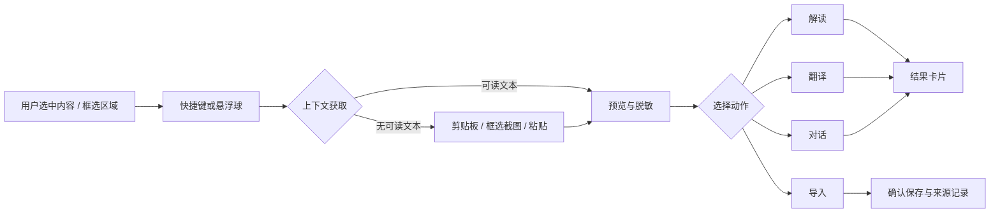

# PRD：小妍 0.6.0 桌面悬浮助手

- 状态：提案，待评审
- 版本：0.6.0
- 负责人：产品 / Desktop（待指定）
- 首发平台：macOS 桌面端；Windows 与 Linux 保留适配接口，不作为 0.6.0 发布承诺
- 目标用户：需要在阅读、写作、检索等多种应用之间切换的科研工作者

## 1. 摘要

0.6.0 将把小妍从应用内的桌面伴侣升级为可在其他应用上方唤起的桌面悬浮助手。用户通过全局快捷键或悬浮球，按需把当前选中文本、剪贴板内容或手动框选屏幕区域交给小妍，用于解读、翻译、追问和导入研究资产。

本版本不做“持续监控整个屏幕”。它只在用户主动触发后读取一次上下文，并在发送模型前让用户确认。这样既能覆盖浏览器、PDF 阅读器、IDE、Office 等应用的高频场景，又不把敏感信息采集变成默认行为。

## 2. 联系人

| 角色 | 人员 | 需要确认的事项 |
| --- | --- | --- |
| 产品负责人 | 待指定 | 首发场景排序、成功指标、灰度范围 |
| Desktop 技术负责人 | 待指定 | macOS 原生权限、窗口与捕获适配器的技术选型 |
| AI / Agent 负责人 | 待指定 | 解读、翻译、追问的提示词、来源与模型策略 |
| 设计负责人 | 待指定 | 悬浮球、结果面板、权限引导和无障碍体验 |
| 隐私与安全评审 | 待指定 | 敏感应用策略、数据保留、日志脱敏与发布文案 |
| 测试负责人 | 待指定 | 多显示器、缩放、权限拒绝和跨应用回归矩阵 |

## 3. 背景

小妍现有桌面伴侣位于主窗口内，负责显示 Agent 状态和研究发现；论文、笔记、翻译、对话与导入能力也已存在于主应用中。用户在浏览器读论文、在 PDF 阅读器标注、在 IDE 看报错或在 Office 写作时，仍需复制内容、切回小妍、执行操作、再回到原应用。这会打断阅读与写作节奏，也让已有能力只能在应用边界内发挥作用。

桌面系统已具备按需提供上下文的通道：macOS 可通过辅助功能读取可访问的界面元素，并通过 ScreenCaptureKit 获取用户授权的画面；Windows UI Automation 可向辅助技术提供界面元素与文本模式。Tauri 也提供跨平台全局快捷键和多窗口能力。可行性不等于无限制访问：不同应用提供的可访问文本质量不同，受保护字段、密码管理器、银行页面、DRM 内容和系统安全界面必须被排除或降级。

因此，本版本的方向是“用户主动选取上下文的小妍入口”，而不是“自动观察所有程序的监控器”。这与项目的本地优先、隐私可控定位一致，并能复用现有本地 SQLite、LLM、聊天、知识笔记、论文导入和长期记忆能力。

## 4. 目标

### 4.1 产品目标

让用户在任何**支持的前台应用**中，无需切回主窗口即可：

1. 对一段文字或一个画面做学术解读；
2. 翻译选中的内容，并方便复制；
3. 围绕当前上下文继续对话；
4. 把确认后的内容导入小妍，成为带来源信息的笔记、图片资产或论文导入候选。

### 4.2 非目标

- 不做后台连续截图、键盘记录、鼠标记录或跨应用行为追踪。
- 不保证从每个第三方应用直接读到选中文本；读取失败时必须有剪贴板或手动截图的降级路径。
- 不在 0.6.0 自动把结果回填、替换到第三方应用中；结果仅支持复制，避免误写入外部文档。
- 不在 0.6.0 发布 Windows/Linux 的完整可用承诺，也不改变 Web/Mobile 的定位。
- 不把悬浮助手做成新的大页面或把平台调用放入 React 页面中。

### 4.3 关键结果

在正式灰度后的连续 28 天内，以匿名、可关闭的本地事件统计衡量：

| KR | 目标 |
| --- | --- |
| 激活 | 已完成权限引导的用户中，至少 35% 每周使用悬浮助手 2 次或以上 |
| 上下文获取 | 主动触发后，至少 90% 的会话在 3 秒内获得“可用文本”或明确的降级入口 |
| 结果可用 | 解读、翻译、对话任务中，至少 85% 成功得到结果或可理解的失败原因 |
| 研究沉淀 | 至少 20% 的有效会话产生一次确认导入或复制动作 |
| 信任 | 权限说明页的拒绝率低于 25%；未出现 P0/P1 级敏感内容误采集事故 |
| 稳定性 | 悬浮助手相关崩溃率低于 0.3%，显著增加的空闲 CPU 平均占用低于 1% |

所有指标只记录动作类别、耗时、结果状态和平台版本；默认不上传原文、截图、应用标题或模型回答。

## 5. 市场与用户场景

### 5.1 核心用户与任务

| 用户任务 | 典型应用 | 当前阻碍 | 0.6.0 的帮助 |
| --- | --- | --- | --- |
| 快速理解论文段落、公式解释或图表 | 浏览器、PDF 阅读器、PPT | 在多个窗口间复制与切换 | 选中后唤起，得到面向科研语境的解释 |
| 翻译英文资料并保留原文语境 | 浏览器、PDF、Word、邮件 | 单独打开翻译工具，术语不统一 | 一次性翻译，支持术语偏好与复制 |
| 追问当前代码、报错或实验日志 | IDE、终端、Jupyter | 上下文难以完整带入对话 | 将选区/截图作为临时对话上下文 |
| 把有价值的材料沉淀入研究库 | 浏览器、PDF、笔记软件 | 复制后容易丢来源，整理滞后 | 导入前预览，自动记录来源应用、窗口标题、时间和用户补充标签 |

### 5.2 首发支持定义

“在整个计算机所有程序上使用”在产品上定义为：当小妍能取得用户主动提供的上下文时，任何前台应用都可以调用同一组操作；并不承诺每个应用都能通过辅助功能直接读出文本。

支持优先级如下：

1. 可读选中文本：从辅助功能或剪贴板取得，体验最佳。
2. 手动框选屏幕区域：取得截图，适合图片、扫描 PDF、表格和不暴露文本的应用。
3. 用户粘贴或拖入：任何环境下都可用的兜底。
4. 受保护内容：不采集，解释原因并提供在主应用中手动输入的替代方式。

## 6. 价值主张

### 6.1 对用户的价值

- **少切换**：不离开正在阅读或写作的应用，就能调用小妍。
- **懂研究语境**：解读与翻译可使用当前研究主题、术语表和已授权的本地知识库，而不是通用问答。
- **可追溯沉淀**：导入的文本和截图带有来源，不再成为孤立的复制片段。
- **用户掌控**：每次采集均由用户触发；可看见将发送的内容、删除敏感部分、拒绝发送或删除记录。

### 6.2 与现有能力的关系

悬浮助手不是第二套聊天和笔记系统。它是现有能力的跨应用入口：

| 悬浮动作 | 复用的现有能力 | 输出 |
| --- | --- | --- |
| 解读 | 多 Agent 对话、论文/知识库检索、视觉模型 | 解释卡片、引用、可继续追问 |
| 翻译 | `translate_text`、模型设置、术语偏好 | 双语结果、复制按钮 |
| 对话 | 会话流式输出、长期记忆与研究主题上下文 | 临时会话，可主动保存为正式会话 |
| 导入文本 | 知识笔记、来源记录 | 草稿笔记或已保存笔记 |
| 导入图片/截图 | 写作图片资产、知识笔记附件 | 本地图片资产与引用信息 |
| 导入 PDF | 论文库上传和解析流水线 | 用户确认后的论文导入候选 |

## 7. 方案

### 7.1 交互与用户流程

#### 常驻形态

- 默认显示一个可拖动的小妍悬浮球，可在设置中关闭或设置为“仅快捷键”。
- 悬浮球停靠在每个显示器的边缘；关闭面板后保留最后位置。它不遮挡鼠标交互，也不抢焦点。
- 默认快捷键建议为 `Option/Alt + Space`；首次启动检测冲突，允许用户改为其他组合。快捷键注册失败时给出可操作的提示。
- 单击悬浮球或按快捷键，打开紧凑动作面板；按 `Esc`、点击外部区域或执行完成后可关闭。面板只在交互期间接收鼠标事件。

#### 标准流程



#### 上下文预览

动作面板顶部始终展示本次将处理的内容摘要：文本显示字符数、来源应用和截断预览；截图显示缩略图和区域大小。用户可以：

- 切换“仅文本 / 截图 / 手动粘贴”的来源；
- 删除不需要的段落或重新框选；
- 在发送前关闭“包含研究主题”和“检索本地知识库”；
- 查看权限状态，并跳转系统设置重新授权。

#### 四个首发动作

| 动作 | 输入 | 首屏结果 | 后续操作 |
| --- | --- | --- | --- |
| 解读 | 文本或截图，可附问题 | 三段式：要点、通俗解释、研究关联；截图可含图表说明 | 追问、复制、保存为笔记、在主窗口展开 |
| 翻译 | 文本为主；截图先 OCR | 译文、关键术语对照、置信提示 | 复制译文/双语、追加术语、保存为笔记 |
| 对话 | 上下文 + 用户问题 | 流式回答，明确当前临时上下文 | 继续问、停止、转为正式会话、复制 |
| 导入 | 文本、截图或拖入文件 | 目标选择和去向预览 | 保存为知识笔记、图片附件、论文导入候选或稍后处理箱 |

### 7.2 功能需求与验收标准

#### F1. 权限引导与状态管理

- 首次启用时，按用途分步说明“辅助功能”“屏幕录制”权限，不使用笼统的“访问所有内容”文案。
- 权限未授予、已拒绝、被系统撤销时，助手仍可使用手动粘贴和剪贴板路径。
- 设置中心提供：总开关、快捷键、悬浮球可见性、允许读取的应用、禁止应用、发送前预览、保存策略、诊断开关。
- **验收**：拒绝任何一项权限后，应用无崩溃、没有循环弹窗；用户可在两步内找到替代输入方式。

#### F2. 上下文采集

- 每次快捷键触发只尝试读取当时的前台应用和当前选择；不在后台轮询窗口、屏幕、剪贴板或输入事件。
- 采集优先顺序为：可访问的选中文本 → 用户允许的当前剪贴板快照 → 用户框选截图 → 粘贴输入。
- 手动框选模式需支持多显示器、Retina/缩放坐标换算、取消和重试。
- 记录采集来源、应用 bundle ID / 进程名、窗口标题（可关闭）、时间和用户是否确认；默认不长期保存原始截图与未导入文本。
- **验收**：在 Safari/Chrome、Preview/常见 PDF 阅读器、VS Code、Word/Pages、终端中，至少有一条路径可完成“获取上下文 → 预览 → 操作”；在无障碍文本不可读的应用中，能在一次交互内进入截图或粘贴降级。

#### F3. 解读、翻译与对话

- 使用现有模型提供者、流式取消、Token 统计与错误处理。上下文作为独立附件传入，不改写用户已有聊天会话。
- 解读默认使用“学术解释”模板；用户可切换为通俗解释、图表解读、代码/报错解读。
- 翻译需复用用户语言和模型设置；术语以用户已保存偏好为先。图像 OCR 与视觉模型结果必须标示“识别可能有误”。
- 回答中应清晰标明本次引用的本地研究主题/笔记来源；未启用本地检索时不得暗示使用了知识库。
- **验收**：文本任务可停止并保留已输出内容；模型失败、网络失败、OCR 为空时均展示下一步；结果能复制且不会自动写入前台第三方应用。

#### F4. 导入与来源追溯

- 文本导入默认创建“待确认笔记草稿”，用户选定研究主题、标题、标签后才保存。
- 截图导入本地应用数据目录，作为笔记附件；记录截图区域、原应用和时间。导出时由用户选择是否带上来源元数据。
- 文件拖入只在用户确认后委托现有论文/知识导入管线；不从其他应用静默读取文件路径。
- 导入发生前展示目的地、是否保留原始内容及所需存储空间。
- **验收**：从悬浮助手保存的一条笔记，在知识库中能看到并编辑；删除该笔记时，关联附件和会话临时缓存按设置清理。

#### F5. 隐私、安全与可访问性

- 永远要求用户动作触发采集，发送模型前默认显示内容预览；“跳过预览”必须由用户在设置中显式开启。
- 默认禁止采集密码输入框、系统安全对话框、钥匙串/密码管理器、金融与认证应用；对无法可靠识别的情况，以不采集为默认。
- 提供应用级允许/禁止列表；禁止名单优先级最高。用户可一键清除临时上下文、悬浮会话和已保存的截图资产。
- 不在日志、埋点、错误上报中写入正文、OCR 文本、窗口标题或截图二进制内容。
- 面板支持键盘操作、可见焦点、屏幕阅读器标签、系统深浅色和动态字体；不得以视觉状态作为唯一提示。
- **验收**：在禁止应用或密码字段触发时，不出现内容预览，不发起模型请求，且提示不暴露敏感字段；日志抽样确认不包含内容载荷。

### 7.3 技术方案

#### 架构边界

悬浮助手是独立功能域。页面只负责入口与设置组合；跨应用采集、权限检查、窗口定位、快捷键、节流和会话状态进入 hook / Rust service，不进入现有 `CompanionRenderer` 或页面 JSX。

```text
前台第三方应用
  └─ 用户快捷键 / 悬浮球
       ├─ assistant-dock：无焦点、点击穿透的悬浮球窗口
       └─ assistant-panel：临时交互面板窗口
            ↓ Tauri command / event
Desktop Assistant Core（Rust）
  ├─ ContextProvider：读取选区、剪贴板、截图区域
  ├─ PermissionService：系统权限、应用允许/禁止策略
  ├─ CaptureSessionService：一次性会话、脱敏、临时文件清理
  ├─ AssistantActionService：解读 / 翻译 / 对话 / 导入路由
  └─ PlatformAdapter：macOS 实现，Windows/Linux 空实现或后续实现
            ↓
现有 LLM、聊天、知识笔记、论文导入、SQLite、文件加密能力
```

#### 代码组织建议

| 位置 | 职责 |
| --- | --- |
| `apps/desktop/src/features/desktop-assistant/shared.ts` | 领域类型、动作、来源、状态、纯函数 |
| `apps/desktop/src/features/desktop-assistant/useAssistantOverlay.ts` | 面板显示、窗口事件与 UI 状态编排 |
| `apps/desktop/src/features/desktop-assistant/useCaptureSession.ts` | 一次性采集会话、预览、重试、取消 |
| `apps/desktop/src/features/desktop-assistant/useAssistantShortcut.ts` | 快捷键注册、冲突与设置同步 |
| `apps/desktop/src/features/desktop-assistant/*Panel.tsx` | 悬浮球、动作面板、采集预览、结果卡片、导入确认 |
| `apps/desktop/src-tauri/src/services/desktop_assistant/` | 权限、会话、动作路由与本地清理服务 |
| `apps/desktop/src-tauri/src/platform/desktop_assistant/` | `PlatformAdapter` trait 与 `macos` / `windows` / `linux` 适配器 |
| `apps/desktop/src-tauri/src/commands/desktop_assistant.rs` | 参数校验后委托 service，禁止承载业务逻辑 |

需要新增 `assistant-dock` 与 `assistant-panel` 两个受限窗口及单独 capability。面板仅获得本功能所需的命令权限；文件读写继续沿用受限路径，不给悬浮窗口宽泛的系统权限。

#### 平台策略

| 能力 | macOS 0.6.0 | Windows 后续 | Linux 后续 |
| --- | --- | --- | --- |
| 全局快捷键 | Tauri 插件 | 同一接口 | 同一接口，桌面环境兼容性单测 |
| 读取选区 | Accessibility API；失败则降级 | UI Automation | AT-SPI/桌面环境适配后评估 |
| 框选截图 | ScreenCaptureKit，按系统授权 | Windows Graphics Capture 评估 | PipeWire/门户 API 评估 |
| 悬浮窗口 | Tauri 多窗口 + 原生窗口属性 | 同一视图层，处理 DPI | 按 Wayland/X11 分别验证 |

在开始正式实现前，必须完成 macOS 技术 Spike，验证：辅助功能权限状态与选区读取、ScreenCaptureKit 区域截图、多显示器坐标、面板不抢焦点、全局快捷键冲突和临时截图清理。Spike 不通过时，0.6.0 降级为“快捷键 + 剪贴板/手动粘贴 + 应用内浮层”，不发布系统级采集承诺。

相关官方资料： [Tauri 全局快捷键](https://v2.tauri.app/plugin/global-shortcut/)、[Tauri 窗口定制](https://v2.tauri.app/learn/window-customization/)、[Apple ScreenCaptureKit](https://developer.apple.com/documentation/screencapturekit)、[Apple AXUIElement](https://developer.apple.com/documentation/applicationservices/axuielement)、[Microsoft UI Automation](https://learn.microsoft.com/en-us/dotnet/framework/ui-automation/ui-automation-overview)。

#### 数据模型与保留策略

新增的数据应保持最小化：

| 实体 | 关键字段 | 默认保留 |
| --- | --- | --- |
| `assistant_capture_sessions` | id、来源类型、应用标识、创建/过期时间、状态 | 仅临时，完成或取消后立即清正文；异常恢复最多 24 小时 |
| `assistant_artifacts` | id、会话 id、导入目标、路径/笔记 id、来源元数据 | 仅用户确认导入后保留，随所属资产删除 |
| `assistant_preferences` | 快捷键、悬浮位置、权限提示状态、允许/禁止应用、预览与保留策略 | 直到用户修改或删除 |

原始文本、OCR 结果和截图不得作为普通会话历史默认落库。若用户选择“保存为笔记”，才将已确认版本交给既有资产表保存。

### 7.4 假设、依赖与风险

| 项目 | 假设或风险 | 缓解方式 | 上线门槛 |
| --- | --- | --- | --- |
| 无障碍数据质量 | 部分应用不暴露选区或窗口标题 | 设计截图、剪贴板、粘贴三条降级路径；不将直接选区读取作为唯一入口 | 目标应用中至少一条路径成功 |
| 系统权限 | 用户可能拒绝 Screen Recording / Accessibility | 分用途解释、按需请求、不阻断基础能力 | 拒绝后仍可完成核心任务 |
| 隐私误采集 | 页面、密码框或窗口标题可能敏感 | 主动触发、预览、禁止名单、字段检测、最小日志 | P0/P1 漏洞清零 |
| 悬浮层干扰 | 抢焦点、遮挡、拖动误触会破坏原工作流 | 点击穿透、短暂激活、Esc 关闭、位置持久化与可关闭 | 常见应用回归无阻塞缺陷 |
| 模型成本与时延 | 截图/视觉模型比文本慢且贵 | 先文本后截图、压缩和尺寸上限、用户可选模型、明确进度与取消 | 文本任务 P95 在可接受范围内，成本有上限 |
| 跨平台范围 | 三个平台原生 API 差异大 | macOS 首发；trait 隔离；Windows/Linux 先做 Spike | 不因跨平台阻塞 macOS 交付 |
| 现有架构 | 伴侣组件和 App 路由已有职责 | 新建 `desktop-assistant` 功能域；不向大组件追加系统调用 | 通过结构评审和相关 type-check |

## 8. 发布计划

### 8.1 分阶段范围

| 阶段 | 交付内容 | 明确不做 |
| --- | --- | --- |
| 发现与 Spike | macOS 权限/选区/截图/多显示器验证；隐私评审；交互原型与 5–8 名目标用户走查 | 业务功能全面开发 |
| 0.6.0 内测 | macOS 悬浮球与快捷键；文本/截图/粘贴采集；解读、翻译、对话、导入笔记/图片；设置、禁止名单、清理机制与基础指标 | 外部应用自动回填；后台持续采集；Windows/Linux 正式支持；复杂自动化工作流 |
| 0.6.0 灰度 | 崩溃与隐私监控；快捷键冲突、失败路径、模型质量迭代；基于反馈扩大 macOS 用户范围 | 未通过门槛时的全量发布 |
| 0.6.1+ | Windows adapter、更多 OCR/表格能力、来源编辑、快捷指令、可选的文件导入拖放 | 需另行评审的跨应用写入权限 |
| 0.7.0 候选 | Linux 可行性结论、应用级工作流、可配置的研究动作模板 | 默认启用自动化或不透明的内容采集 |

### 8.2 发布门槛

- macOS 技术 Spike 的关键路径通过，或已明确降级方案并更新对外文案。
- 安全评审确认禁止应用、敏感字段、日志和临时文件清理均有测试覆盖。
- 核心流程在至少两种分辨率、Retina 与非 Retina、单/多显示器、授予/拒绝权限下回归通过。
- 相关 Rust/TypeScript 单元测试、桌面端 type-check、仓库级 `pnpm type-check` 和 `pnpm lint` 通过。
- 灰度期间未发现 P0/P1 隐私或跨应用阻塞问题，且核心 KR 的早期信号达到预期方向。

### 8.3 需在立项评审中定夺的事项

1. 首发默认快捷键与产品命名（“桌面悬浮助手”是否作为用户可见名称）。
2. 是否在 0.6.0 内测阶段把截图发送至第三方模型；若允许，需要单独的视觉内容提示与保留说明。
3. 应用禁止名单的预置范围，以及企业/校园环境下的管理员策略。
4. “导入”首发目标是否只限知识笔记和图片，还是同时包含 PDF 论文库。
5. 是否允许用户显式开启“跳过发送前预览”；建议默认不提供或仅在高级设置开启。
