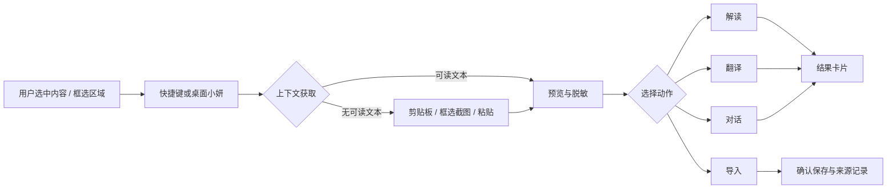
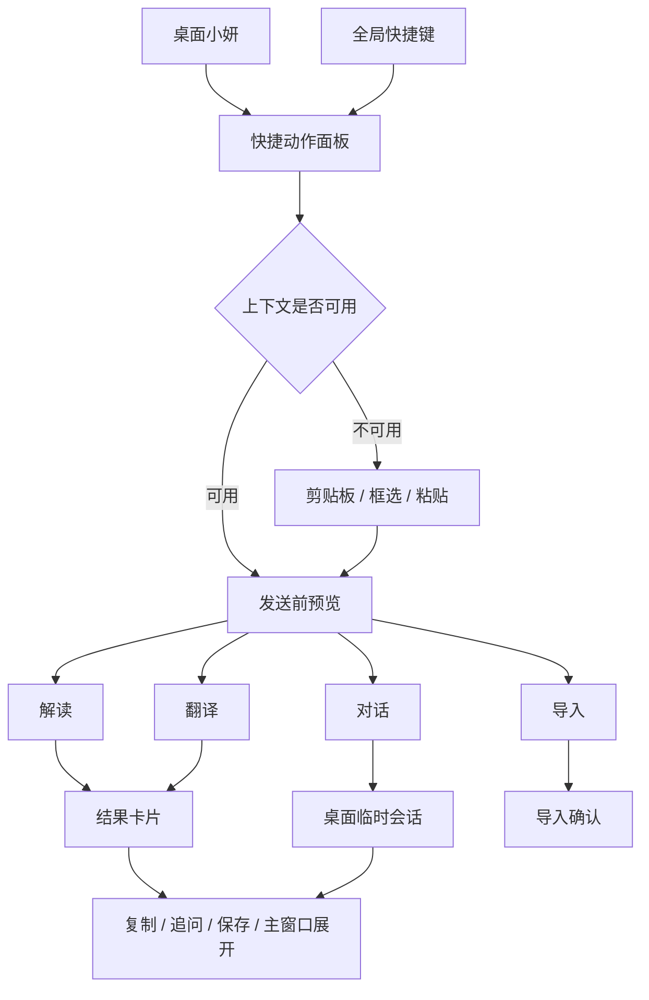
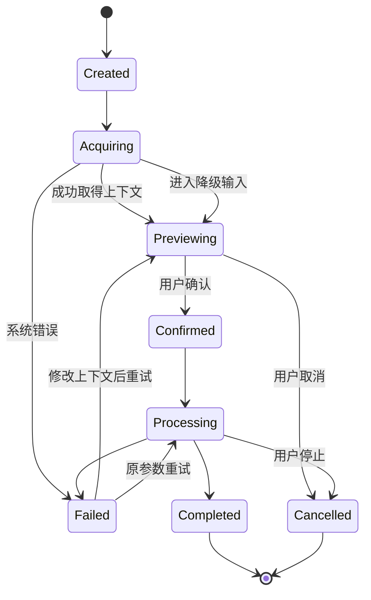

# PRD：0.6.0 小妍桌面助手

- 状态：提案，待评审
- 版本：0.6.0
- 负责人：产品 / Desktop（待指定）
- 首发平台：macOS 桌面端；Windows 与 Linux 保留适配接口，不作为 0.6.0 发布承诺
- 目标用户：需要在阅读、写作、检索等多种应用之间切换的科研工作者

## 1. 摘要

0.6.0 将把小妍从应用内的桌面伴侣升级为可在其他应用上方唤起的小妍桌面助手。用户通过全局快捷键或桌面小妍形象，按需把当前选中文本、剪贴板内容或手动框选屏幕区域交给小妍，用于解读、翻译、追问和导入研究资产。

本版本不做“持续监控整个屏幕”。它只在用户主动触发后读取一次上下文，并在发送模型前让用户确认。这样既能覆盖浏览器、PDF 阅读器、IDE、Office 等应用的高频场景，又不把敏感信息采集变成默认行为。

## 2. 联系人

| 角色 | 人员 | 需要确认的事项 |
| --- | --- | --- |
| 产品负责人 | 待指定 | 首发场景排序、成功指标、灰度范围 |
| Desktop 技术负责人 | 待指定 | macOS 原生权限、窗口与捕获适配器的技术选型 |
| AI / Agent 负责人 | 待指定 | 解读、翻译、追问的提示词、来源与模型策略 |
| 设计负责人 | 待指定 | 桌面小妍形象、角色动画、结果面板、权限引导和无障碍体验 |
| 隐私与安全评审 | 待指定 | 敏感应用策略、数据保留、日志脱敏与发布文案 |
| 测试负责人 | 待指定 | 多显示器、缩放、权限拒绝和跨应用回归矩阵 |

## 3. 背景

小妍现有桌面伴侣位于主窗口内，负责显示 Agent 状态和研究发现；论文、笔记、翻译、对话与导入能力也已存在于主应用中。用户在浏览器读论文、在 PDF 阅读器标注、在 IDE 看报错或在 Office 写作时，仍需复制内容、切回小妍、执行操作、再回到原应用。这会打断阅读与写作节奏，也让已有能力只能在应用边界内发挥作用。

桌面系统已具备按需提供上下文的通道：macOS 可通过辅助功能读取可访问的界面元素，并通过 ScreenCaptureKit 获取用户授权的画面；Windows UI Automation 可向辅助技术提供界面元素与文本模式。Tauri 也提供跨平台全局快捷键和多窗口能力。可行性不等于无限制访问：不同应用提供的可访问文本质量不同，受保护字段、密码管理器、银行页面、DRM 内容和系统安全界面必须被排除或降级。

因此，本版本的方向是“用户主动选取上下文的小妍入口”，而不是“自动观察所有程序的监控器”。这与项目的本地优先、隐私可控定位一致，并能复用现有本地 SQLite、LLM、聊天、知识笔记、论文导入和长期记忆能力。

## 4. 目标

### 4.1 产品目标

让用户在任何**支持的前台应用**中，无需切回主窗口即可：

1. 对一段文字或一个画面做学术解读；
2. 翻译选中的内容，并方便复制；
3. 围绕当前上下文继续对话；
4. 把确认后的内容导入小妍，成为带来源信息的笔记、图片资产或论文导入候选。

### 4.2 非目标

- 不做后台连续截图、键盘记录、鼠标记录或跨应用行为追踪。
- 不保证从每个第三方应用直接读到选中文本；读取失败时必须有剪贴板或手动截图的降级路径。
- 不在 0.6.0 自动把结果回填、替换到第三方应用中；结果仅支持复制，避免误写入外部文档。
- 不在 0.6.0 发布 Windows/Linux 的完整可用承诺，也不改变 Web/Mobile 的定位。
- 不把小妍桌面助手做成新的大页面或把平台调用放入 React 页面中。

### 4.3 关键结果

在正式灰度后的连续 28 天内，以匿名、可关闭的本地事件统计衡量：

| KR | 目标 |
| --- | --- |
| 激活 | 已完成权限引导的用户中，至少 35% 每周使用小妍桌面助手 2 次或以上 |
| 上下文获取 | 主动触发后，至少 90% 的会话在 3 秒内获得“可用文本”或明确的降级入口 |
| 结果可用 | 解读、翻译、对话任务中，至少 85% 成功得到结果或可理解的失败原因 |
| 研究沉淀 | 至少 20% 的有效会话产生一次确认导入或复制动作 |
| 信任 | 权限说明页的拒绝率低于 25%；未出现 P0/P1 级敏感内容误采集事故 |
| 稳定性 | 小妍桌面助手相关崩溃率低于 0.3%，显著增加的空闲 CPU 平均占用低于 1% |

所有指标只记录动作类别、耗时、结果状态和平台版本；默认不上传原文、截图、应用标题或模型回答。

## 5. 市场与用户场景

### 5.1 核心用户与任务

| 用户任务 | 典型应用 | 当前阻碍 | 0.6.0 的帮助 |
| --- | --- | --- | --- |
| 快速理解论文段落、公式解释或图表 | 浏览器、PDF 阅读器、PPT | 在多个窗口间复制与切换 | 选中后唤起，得到面向科研语境的解释 |
| 翻译英文资料并保留原文语境 | 浏览器、PDF、Word、邮件 | 单独打开翻译工具，术语不统一 | 一次性翻译，支持术语偏好与复制 |
| 追问当前代码、报错或实验日志 | IDE、终端、Jupyter | 上下文难以完整带入对话 | 将选区/截图作为临时对话上下文 |
| 把有价值的材料沉淀入研究库 | 浏览器、PDF、笔记软件 | 复制后容易丢来源，整理滞后 | 导入前预览，自动记录来源应用、窗口标题、时间和用户补充标签 |

### 5.2 首发支持定义

“在整个计算机所有程序上使用”在产品上定义为：当小妍能取得用户主动提供的上下文时，任何前台应用都可以调用同一组操作；并不承诺每个应用都能通过辅助功能直接读出文本。

支持优先级如下：

1. 可读选中文本：从辅助功能或剪贴板取得，体验最佳。
2. 手动框选屏幕区域：取得截图，适合图片、扫描 PDF、表格和不暴露文本的应用。
3. 用户粘贴或拖入：任何环境下都可用的兜底。
4. 受保护内容：不采集，解释原因并提供在主应用中手动输入的替代方式。

## 6. 价值主张

### 6.1 对用户的价值

- **少切换**：不离开正在阅读或写作的应用，就能调用小妍。
- **懂研究语境**：解读与翻译可使用当前研究主题、术语表和已授权的本地知识库，而不是通用问答。
- **可追溯沉淀**：导入的文本和截图带有来源，不再成为孤立的复制片段。
- **用户掌控**：每次采集均由用户触发；可看见将发送的内容、删除敏感部分、拒绝发送或删除记录。

### 6.2 与现有能力的关系

小妍桌面助手不是第二套聊天和笔记系统。它是现有能力的跨应用入口：

| 桌面快捷动作 | 复用的现有能力 | 输出 |
| --- | --- | --- |
| 解读 | 多 Agent 对话、论文/知识库检索、视觉模型 | 解释卡片、引用、可继续追问 |
| 翻译 | `translate_text`、模型设置、术语偏好 | 双语结果、复制按钮 |
| 对话 | 会话流式输出、长期记忆与研究主题上下文 | 临时会话，可主动保存为正式会话 |
| 导入文本 | 知识笔记、来源记录 | 草稿笔记或已保存笔记 |
| 导入图片/截图 | 写作图片资产、知识笔记附件 | 本地图片资产与引用信息 |
| 导入 PDF | 论文库上传和解析流水线 | 用户确认后的论文导入候选 |

## 7. 方案

### 7.1 交互与用户流程

#### 常驻形态

- 默认显示可拖动的小妍完整角色形象，可在设置中关闭或设置为“仅快捷键”。它不是被圆形容器包裹的悬浮球或通用工具按钮。
- 桌面小妍以自然站位停靠在每个显示器的边缘；关闭面板后保留最后位置。小妍不带外层球形背景、卡片或阴影，不抢焦点，角色可见区域之外尽量不遮挡鼠标交互。
- 默认快捷键建议为 `Option/Alt + Space`；首次启动检测冲突，允许用户改为其他组合。快捷键注册失败时给出可操作的提示。
- 单击桌面小妍或按快捷键，打开紧凑动作面板；按 `Esc`、点击外部区域或执行完成后可关闭。面板只在交互期间接收鼠标事件。

#### 标准流程


```mermaid
flowchart LR
  A[用户选中内容 / 框选区域] --> B[快捷键或桌面小妍]
  B --> C{上下文获取}
  C -->|可读文本| D[预览与脱敏]
  C -->|无可读文本| E[剪贴板 / 框选截图 / 粘贴]
  E --> D
  D --> F{选择动作}
  F --> G[解读]
  F --> H[翻译]
  F --> I[对话]
  F --> J[导入]
  G --> K[结果卡片]
  H --> K
  I --> K
  J --> L[确认保存与来源记录]
```

#### 上下文预览

动作面板顶部始终展示本次将处理的内容摘要：文本显示字符数、来源应用和截断预览；截图显示缩略图和区域大小。用户可以：

- 切换“仅文本 / 截图 / 手动粘贴”的来源；
- 删除不需要的段落或重新框选；
- 在发送前关闭“包含研究主题”和“检索本地知识库”；
- 查看权限状态，并跳转系统设置重新授权。

#### 四个首发动作

| 动作 | 输入 | 首屏结果 | 后续操作 |
| --- | --- | --- | --- |
| 解读 | 文本或截图，可附问题 | 三段式：要点、通俗解释、研究关联；截图可含图表说明 | 追问、复制、保存为笔记、在主窗口展开 |
| 翻译 | 文本为主；截图先 OCR | 译文、关键术语对照、置信提示 | 复制译文/双语、追加术语、保存为笔记 |
| 对话 | 上下文 + 用户问题 | 流式回答，明确当前临时上下文 | 继续问、停止、转为正式会话、复制 |
| 导入 | 文本、截图或拖入文件 | 目标选择和去向预览 | 保存为知识笔记、图片附件、论文导入候选或稍后处理箱 |

### 7.2 功能需求与验收标准

#### F1. 权限引导与状态管理

- 首次启用时，按用途分步说明“辅助功能”“屏幕录制”权限，不使用笼统的“访问所有内容”文案。
- 权限未授予、已拒绝、被系统撤销时，助手仍可使用手动粘贴和剪贴板路径。
- 设置中心提供：总开关、快捷键、桌面小妍可见性、允许读取的应用、禁止应用、发送前预览、保存策略、诊断开关。
- **验收**：拒绝任何一项权限后，应用无崩溃、没有循环弹窗；用户可在两步内找到替代输入方式。

#### F2. 上下文采集

- 每次快捷键触发只尝试读取当时的前台应用和当前选择；不在后台轮询窗口、屏幕、剪贴板或输入事件。
- 采集优先顺序为：可访问的选中文本 → 用户允许的当前剪贴板快照 → 用户框选截图 → 粘贴输入。
- 手动框选模式需支持多显示器、Retina/缩放坐标换算、取消和重试。
- 记录采集来源、应用 bundle ID / 进程名、窗口标题（可关闭）、时间和用户是否确认；默认不长期保存原始截图与未导入文本。
- **验收**：在 Safari/Chrome、Preview/常见 PDF 阅读器、VS Code、Word/Pages、终端中，至少有一条路径可完成“获取上下文 → 预览 → 操作”；在无障碍文本不可读的应用中，能在一次交互内进入截图或粘贴降级。

#### F3. 解读、翻译与对话

- 使用现有模型提供者、流式取消、Token 统计与错误处理。上下文作为独立附件传入，不改写用户已有聊天会话。
- 解读默认使用“学术解释”模板；用户可切换为通俗解释、图表解读、代码/报错解读。
- 翻译需复用用户语言和模型设置；术语以用户已保存偏好为先。图像 OCR 与视觉模型结果必须标示“识别可能有误”。
- 回答中应清晰标明本次引用的本地研究主题/笔记来源；未启用本地检索时不得暗示使用了知识库。
- **验收**：文本任务可停止并保留已输出内容；模型失败、网络失败、OCR 为空时均展示下一步；结果能复制且不会自动写入前台第三方应用。

#### F4. 导入与来源追溯

- 文本导入默认创建“待确认笔记草稿”，用户选定研究主题、标题、标签后才保存。
- 截图导入本地应用数据目录，作为笔记附件；记录截图区域、原应用和时间。导出时由用户选择是否带上来源元数据。
- 文件拖入只在用户确认后委托现有论文/知识导入管线；不从其他应用静默读取文件路径。
- 导入发生前展示目的地、是否保留原始内容及所需存储空间。
- **验收**：从小妍桌面助手保存的一条笔记，在知识库中能看到并编辑；删除该笔记时，关联附件和会话临时缓存按设置清理。

#### F5. 隐私、安全与可访问性

- 永远要求用户动作触发采集，发送模型前默认显示内容预览；“跳过预览”必须由用户在设置中显式开启。
- 默认禁止采集密码输入框、系统安全对话框、钥匙串/密码管理器、金融与认证应用；对无法可靠识别的情况，以不采集为默认。
- 提供应用级允许/禁止列表；禁止名单优先级最高。用户可一键清除临时上下文、桌面临时会话和已保存的截图资产。
- 不在日志、埋点、错误上报中写入正文、OCR 文本、窗口标题或截图二进制内容。
- 面板支持键盘操作、可见焦点、屏幕阅读器标签、系统深浅色和动态字体；不得以视觉状态作为唯一提示。
- **验收**：在禁止应用或密码字段触发时，不出现内容预览，不发起模型请求，且提示不暴露敏感字段；日志抽样确认不包含内容载荷。

### 7.3 技术方案

#### 架构边界

小妍桌面助手是独立功能域。页面只负责入口与设置组合；跨应用采集、权限检查、窗口定位、快捷键、节流和会话状态进入 hook / Rust service，不进入现有 `CompanionRenderer` 或页面 JSX。

```text
前台第三方应用
  └─ 用户快捷键 / 桌面小妍形象
       ├─ assistant-dock：无焦点、透明背景的桌面小妍角色窗口
       └─ assistant-panel：临时交互面板窗口
            ↓ Tauri command / event
Desktop Assistant Core（Rust）
  ├─ ContextProvider：读取选区、剪贴板、截图区域
  ├─ PermissionService：系统权限、应用允许/禁止策略
  ├─ CaptureSessionService：一次性会话、脱敏、临时文件清理
  ├─ AssistantActionService：解读 / 翻译 / 对话 / 导入路由
  └─ PlatformAdapter：macOS 实现，Windows/Linux 空实现或后续实现
            ↓
现有 LLM、聊天、知识笔记、论文导入、SQLite、文件加密能力
```

#### 代码组织建议

| 位置 | 职责 |
| --- | --- |
| `apps/desktop/src/features/desktop-assistant/shared.ts` | 领域类型、动作、来源、状态、纯函数 |
| `apps/desktop/src/features/desktop-assistant/useAssistantOverlay.ts` | 面板显示、窗口事件与 UI 状态编排 |
| `apps/desktop/src/features/desktop-assistant/useCaptureSession.ts` | 一次性采集会话、预览、重试、取消 |
| `apps/desktop/src/features/desktop-assistant/useAssistantShortcut.ts` | 快捷键注册、冲突与设置同步 |
| `apps/desktop/src/features/desktop-assistant/*Panel.tsx` | 桌面小妍形象、动作面板、采集预览、结果卡片、导入确认 |
| `apps/desktop/src-tauri/src/services/desktop_assistant/` | 权限、会话、动作路由与本地清理服务 |
| `apps/desktop/src-tauri/src/platform/desktop_assistant/` | `PlatformAdapter` trait 与 `macos` / `windows` / `linux` 适配器 |
| `apps/desktop/src-tauri/src/commands/desktop_assistant.rs` | 参数校验后委托 service，禁止承载业务逻辑 |

需要新增 `assistant-dock` 与 `assistant-panel` 两个受限窗口及单独 capability。面板仅获得本功能所需的命令权限；文件读写继续沿用受限路径，不给悬浮窗口宽泛的系统权限。

#### 平台策略

| 能力 | macOS 0.6.0 | Windows 后续 | Linux 后续 |
| --- | --- | --- | --- |
| 全局快捷键 | Tauri 插件 | 同一接口 | 同一接口，桌面环境兼容性单测 |
| 读取选区 | Accessibility API；失败则降级 | UI Automation | AT-SPI/桌面环境适配后评估 |
| 框选截图 | ScreenCaptureKit，按系统授权 | Windows Graphics Capture 评估 | PipeWire/门户 API 评估 |
| 悬浮窗口 | Tauri 多窗口 + 原生窗口属性 | 同一视图层，处理 DPI | 按 Wayland/X11 分别验证 |

在开始正式实现前，必须完成 macOS 技术 Spike，验证：辅助功能权限状态与选区读取、ScreenCaptureKit 区域截图、多显示器坐标、面板不抢焦点、全局快捷键冲突和临时截图清理。Spike 不通过时，0.6.0 降级为“快捷键 + 剪贴板/手动粘贴 + 应用内浮层”，不发布系统级采集承诺。

相关官方资料： [Tauri 全局快捷键](https://v2.tauri.app/plugin/global-shortcut/)、[Tauri 窗口定制](https://v2.tauri.app/learn/window-customization/)、[Apple ScreenCaptureKit](https://developer.apple.com/documentation/screencapturekit)、[Apple AXUIElement](https://developer.apple.com/documentation/applicationservices/axuielement)、[Microsoft UI Automation](https://learn.microsoft.com/en-us/dotnet/framework/ui-automation/ui-automation-overview)。

#### 数据模型与保留策略

新增的数据应保持最小化：

| 实体 | 关键字段 | 默认保留 |
| --- | --- | --- |
| `assistant_capture_sessions` | id、来源类型、应用标识、创建/过期时间、状态 | 仅临时，完成或取消后立即清正文；异常恢复最多 24 小时 |
| `assistant_artifacts` | id、会话 id、导入目标、路径/笔记 id、来源元数据 | 仅用户确认导入后保留，随所属资产删除 |
| `assistant_preferences` | 快捷键、桌面小妍站位、权限提示状态、允许/禁止应用、预览与保留策略 | 直到用户修改或删除 |

原始文本、OCR 结果和截图不得作为普通会话历史默认落库。若用户选择“保存为笔记”，才将已确认版本交给既有资产表保存。

### 7.4 假设、依赖与风险

| 项目 | 假设或风险 | 缓解方式 | 上线门槛 |
| --- | --- | --- | --- |
| 无障碍数据质量 | 部分应用不暴露选区或窗口标题 | 设计截图、剪贴板、粘贴三条降级路径；不将直接选区读取作为唯一入口 | 目标应用中至少一条路径成功 |
| 系统权限 | 用户可能拒绝 Screen Recording / Accessibility | 分用途解释、按需请求、不阻断基础能力 | 拒绝后仍可完成核心任务 |
| 隐私误采集 | 页面、密码框或窗口标题可能敏感 | 主动触发、预览、禁止名单、字段检测、最小日志 | P0/P1 漏洞清零 |
| 桌面角色与面板干扰 | 抢焦点、遮挡、拖动误触会破坏原工作流 | 透明命中区域、短暂激活、Esc 关闭、位置持久化与可关闭 | 常见应用回归无阻塞缺陷 |
| 模型成本与时延 | 截图/视觉模型比文本慢且贵 | 先文本后截图、压缩和尺寸上限、用户可选模型、明确进度与取消 | 文本任务 P95 在可接受范围内，成本有上限 |
| 跨平台范围 | 三个平台原生 API 差异大 | macOS 首发；trait 隔离；Windows/Linux 先做 Spike | 不因跨平台阻塞 macOS 交付 |
| 现有架构 | 伴侣组件和 App 路由已有职责 | 新建 `desktop-assistant` 功能域；不向大组件追加系统调用 | 通过结构评审和相关 type-check |

## 8. 发布计划

### 8.1 分阶段范围

| 阶段 | 交付内容 | 明确不做 |
| --- | --- | --- |
| 发现与 Spike | macOS 权限/选区/截图/多显示器验证；隐私评审；交互原型与 5–8 名目标用户走查 | 业务功能全面开发 |
| 0.6.0 内测 | macOS 桌面小妍形象与快捷键；文本/截图/粘贴采集；解读、翻译、对话、导入笔记/图片；设置、禁止名单、清理机制与基础指标 | 外部应用自动回填；后台持续采集；Windows/Linux 正式支持；复杂自动化工作流 |
| 0.6.0 灰度 | 崩溃与隐私监控；快捷键冲突、失败路径、模型质量迭代；基于反馈扩大 macOS 用户范围 | 未通过门槛时的全量发布 |
| 0.6.1+ | Windows adapter、更多 OCR/表格能力、来源编辑、快捷指令、可选的文件导入拖放 | 需另行评审的跨应用写入权限 |
| 0.7.0 候选 | Linux 可行性结论、应用级工作流、可配置的研究动作模板 | 默认启用自动化或不透明的内容采集 |

### 8.2 发布门槛

- macOS 技术 Spike 的关键路径通过，或已明确降级方案并更新对外文案。
- 安全评审确认禁止应用、敏感字段、日志和临时文件清理均有测试覆盖。
- 核心流程在至少两种分辨率、Retina 与非 Retina、单/多显示器、授予/拒绝权限下回归通过。
- 相关 Rust/TypeScript 单元测试、桌面端 type-check、仓库级 `pnpm type-check` 和 `pnpm lint` 通过。
- 灰度期间未发现 P0/P1 隐私或跨应用阻塞问题，且核心 KR 的早期信号达到预期方向。

### 8.3 需在立项评审中定夺的事项

1. 首发默认快捷键；用户可见产品名称统一为“小妍桌面助手”，常驻角色称为“桌面小妍”。
2. 是否在 0.6.0 内测阶段把截图发送至第三方模型；若允许，需要单独的视觉内容提示与保留说明。
3. 应用禁止名单的预置范围，以及企业/校园环境下的管理员策略。
4. “导入”首发目标是否只限知识笔记和图片，还是同时包含 PDF 论文库。
5. 是否允许用户显式开启“跳过发送前预览”；建议默认不提供或仅在高级设置开启。

## 9. 产品信息架构

### 9.1 用户可见组成

小妍桌面助手由五个用户可见部分组成：

1. **桌面小妍 `Assistant Character`**：以完整小妍角色形象常驻于桌面边缘，通过注视、待机、思考、完成和失败等角色状态提供反馈，不使用球形或卡片外容器。内部窗口 label 仍为 `assistant-dock`。
2. **快捷动作面板 `Assistant Panel`**：用户触发后展示上下文预览、动作入口和处理结果。
3. **区域截图层 `Capture Overlay`**：用于手动框选屏幕中的图片、表格、公式或不可访问文本。
4. **桌面临时会话 `Assistant Session`**：保存本次临时问答、上下文和中间结果，但默认不进入正式会话历史。
5. **桌面助手设置区**：管理开关、权限、快捷键、应用规则、预览策略、临时数据与诊断信息。

五部分应保持同一状态源，禁止各窗口分别维护一套上下文或任务状态。

### 9.2 主入口关系


```mermaid
flowchart TD
    A[桌面小妍] --> C[快捷动作面板]
    B[全局快捷键] --> C
    C --> D{上下文是否可用}
    D -->|可用| E[发送前预览]
    D -->|不可用| F[剪贴板 / 框选 / 粘贴]
    F --> E
    E --> G[解读]
    E --> H[翻译]
    E --> I[对话]
    E --> J[导入]
    G --> K[结果卡片]
    H --> K
    I --> L[桌面临时会话]
    J --> M[导入确认]
    K --> N[复制 / 追问 / 保存 / 主窗口展开]
    L --> N
```

### 9.3 主窗口与小妍桌面助手的关系

小妍桌面助手不拥有独立的研究资产体系。它只负责：

* 获取一次性外部上下文；
* 调用现有模型、Agent、翻译和导入能力；
* 生成临时结果；
* 将用户确认的结果交给现有论文、知识、写作或会话模块。

主窗口负责：

* 正式会话管理；
* 知识笔记编辑；
* 论文解析与入库；
* 图片资产管理；
* 长期记忆与研究主题管理；
* 完整任务轨迹和历史查看。

当用户点击“在主窗口继续”时，应打开对应正式页面并恢复当前上下文，而不是仅打开应用首页。

---

## 10. 核心对象与状态模型

### 10.1 捕获会话

每次用户主动触发小妍桌面助手，都创建一个 `CaptureSession`。一次会话只能对应一次前台上下文快照，但可以进行多轮解读、翻译或追问。

```ts
type CaptureSourceType =
  | 'accessibility-selection'
  | 'clipboard-text'
  | 'screen-region'
  | 'manual-text'
  | 'dropped-file'

type CaptureSessionStatus =
  | 'created'
  | 'acquiring'
  | 'previewing'
  | 'confirmed'
  | 'processing'
  | 'completed'
  | 'cancelled'
  | 'failed'
  | 'expired'

interface CaptureSession {
  id: string
  sourceType: CaptureSourceType
  status: CaptureSessionStatus
  appIdentifier?: string
  appDisplayName?: string
  windowTitle?: string
  textPreview?: string
  imagePreviewPath?: string
  createdAt: string
  expiresAt: string
  confirmedAt?: string
  privacyFlags: string[]
}
```

### 10.2 桌面临时会话

`AssistantSession` 是围绕一次捕获上下文进行的临时对话。

```ts
type AssistantSessionStatus =
  | 'idle'
  | 'streaming'
  | 'stopped'
  | 'completed'
  | 'failed'
  | 'promoted'
  | 'discarded'

interface AssistantSession {
  id: string
  captureSessionId: string
  action: 'explain' | 'translate' | 'chat' | 'import'
  status: AssistantSessionStatus
  researchTopicId?: string
  useLocalKnowledge: boolean
  messages: AssistantSessionMessage[]
  promotedConversationId?: string
}
```

桌面临时会话默认不作为普通聊天记录长期保存。只有用户执行“保存为正式会话”后，才创建正式会话，并将已确认上下文及消息复制到既有会话体系。

### 10.3 任务状态机


```mermaid
stateDiagram-v2
    [*] --> Created
    Created --> Acquiring
    Acquiring --> Previewing: 成功取得上下文
    Acquiring --> Previewing: 进入降级输入
    Acquiring --> Failed: 系统错误
    Previewing --> Confirmed: 用户确认
    Previewing --> Cancelled: 用户取消
    Confirmed --> Processing
    Processing --> Completed
    Processing --> Failed
    Processing --> Cancelled: 用户停止
    Failed --> Previewing: 修改上下文后重试
    Failed --> Processing: 原参数重试
    Completed --> [*]
    Cancelled --> [*]
```

状态迁移必须由统一 service 控制，React 组件只消费状态，不自行拼接状态变化。

---

## 11. 上下文采集详细规则

### 11.1 采集优先级

每次触发按照以下顺序尝试：

1. 当前辅助功能选中文本；
2. 用户允许读取的当前剪贴板文本；
3. 手动框选截图；
4. 用户粘贴文本；
5. 拖入文件。

系统不得因为第一种方式失败而直接结束，应立即提供后续降级入口。现有 PRD 已规定至少保留截图、剪贴板与粘贴三条降级路径。

### 11.2 文本选区规则

直接读取选中文本时，应满足：

* 仅读取当前前台应用；
* 仅读取用户触发瞬间的当前选区；
* 不保存选区变化历史；
* 不循环轮询辅助功能树；
* 不读取密码字段、受保护字段和不可识别的安全输入；
* 超过字符上限时只读取限定长度，并明确提示截断；
* 保留原始换行和基础列表结构；
* 无法可靠读取时，不猜测文本内容。

建议默认字符上限：

| 场景    |      默认上限 |
| ----- | --------: |
| 解读    | 12,000 字符 |
| 翻译    | 20,000 字符 |
| 对话上下文 | 16,000 字符 |
| 保存笔记  | 50,000 字符 |
| 窗口标题  |    200 字符 |

超过上限时，用户可以选择：

* 仅处理当前截取内容；
* 缩小选区；
* 在主窗口中处理完整文档。

### 11.3 剪贴板规则

剪贴板仅在以下条件同时成立时读取：

* 本次操作由用户主动触发；
* 用户未关闭剪贴板降级；
* 当前没有可用选中文本，或用户主动选择剪贴板；
* 剪贴板内容属于允许类型；
* 内容通过敏感信息基础检查。

小妍桌面助手不得监听剪贴板变化，也不得维护剪贴板历史。

### 11.4 区域截图规则

区域截图流程应包括：

1. 隐藏桌面动作面板；
2. 冻结当前捕获目标；
3. 展示跨显示器选区层；
4. 用户拖动选择区域；
5. 显示尺寸和确认按钮；
6. 生成临时截图；
7. 回到预览页；
8. 用户确认后才发送模型。

截图应支持：

* 单显示器和多显示器；
* Retina 与非 Retina；
* 不同缩放比例；
* Esc 取消；
* 重新框选；
* 尺寸过小时提示；
* 尺寸过大时压缩；
* 临时文件自动清理。

### 11.5 文件拖放

首发可支持：

* PDF；
* PNG、JPEG、WebP；
* Markdown；
* TXT。

不直接支持：

* 可执行文件；
* 压缩包自动解压；
* Office 文档深度解析；
* 未知二进制格式；
* 文件夹递归导入。

文件拖入后只创建导入候选，用户确认目的地后才进入现有导入流程。

---

## 12. 发送前预览与脱敏

### 12.1 预览内容

发送前预览页至少展示：

* 内容类型；
* 字符数或图片尺寸；
* 来源应用；
* 窗口标题是否包含；
* 将使用的研究主题；
* 是否启用本地知识检索；
* 将调用的任务模型；
* 内容是否会发送至第三方服务；
* 临时数据保留策略。

### 12.2 用户可编辑能力

文本预览支持：

* 删除段落；
* 修改文本；
* 取消窗口标题；
* 取消来源应用记录；
* 取消研究主题；
* 关闭本地知识检索；
* 修改本次问题；
* 重新获取上下文。

图片预览支持：

* 重新框选；
* 裁剪边缘；
* 删除截图；
* 添加文字问题；
* 切换视觉模型；
* 选择是否保存截图。

### 12.3 基础敏感信息检测

0.6.0 只做防误操作级检测，不承诺完整 DLP。可以检测：

* 密码字段标识；
* API Key 常见格式；
* 私钥头部；
* 身份证和银行卡疑似连续数字；
* 验证码和一次性口令关键词；
* 系统安全窗口与密码管理器应用标识。

命中规则时：

* 默认遮盖疑似敏感片段；
* 明确告知用户；
* 用户需要再次确认才能继续；
* 对明确禁止的密码字段直接阻止处理；
* 日志只记录规则编号，不记录命中内容。

---

## 13. 四类动作详细设计

### 13.1 解读

#### 解读模式

* 学术解读；
* 通俗解释；
* 公式解释；
* 图表解读；
* 代码与报错分析；
* 写作点评。

#### 默认结果结构

```text
核心内容
一句话说明该内容在讲什么。

详细解释
按概念、方法、条件和结论展开说明。

研究关联
说明它与当前研究主题、已有论文或笔记可能有什么关系。

不确定项
指出识别、来源或推断中存在的不确定部分。
```

#### 可执行动作

* 继续追问；
* 复制结果；
* 复制原文与结果；
* 保存为知识笔记；
* 添加到现有笔记；
* 在主窗口展开；
* 清除临时上下文。

### 13.2 翻译

#### 输出内容

* 完整译文；
* 关键术语对照；
* 专有名词保留说明；
* OCR 或图像识别置信提示；
* 可选的句式润色版本。

#### 翻译模式

* 忠实直译；
* 学术中文；
* 简明中文；
* 中译英学术表达；
* 双语对照。

#### 术语处理

优先级为：

1. 用户术语表；
2. 当前研究主题术语；
3. 已保存知识笔记中的稳定译法；
4. 模型默认翻译。

当术语存在多种译法时，结果卡片应允许用户选择并保存为术语偏好。

### 13.3 临时对话

临时对话应明确展示：

```text
本次对话基于：
- 当前选中文本
- 来源应用：Preview
- 当前研究主题：时序知识图谱
- 本地知识检索：已开启
```

用户后续追问时，默认继续使用本次捕获内容，但不得重新读取第三方应用。

临时对话应支持：

* 流式输出；
* 停止生成；
* 重新生成；
* 修改问题；
* 清除某一上下文项；
* 转为正式会话；
* 在主窗口继续；
* 关闭后删除。

### 13.4 导入

导入目标包括：

| 输入类型         | 首发目标                   |
| ------------ | ---------------------- |
| 文本           | 新建知识笔记草稿、追加到已有笔记、稍后处理箱 |
| 截图           | 知识笔记附件、写作图片资产、稍后处理箱    |
| PDF          | 论文导入候选                 |
| Markdown/TXT | 知识笔记导入候选               |

导入前必须确认：

* 研究主题；
* 标题；
* 标签；
* 来源信息；
* 是否保留原始内容；
* 目标位置；
* 预计存储空间。

---

## 14. 稍后处理箱

### 14.1 设计目的

用户在跨应用阅读时，往往只想快速收集内容，不希望立即整理。建议在 0.6.0 增加轻量级“稍后处理箱”，作为小妍桌面助手与正式知识资产之间的缓冲层。

### 14.2 支持内容

* 文本片段；
* 截图；
* PDF 导入候选；
* 临时解读结果；
* 临时翻译结果；
* 未转正的桌面临时会话。

### 14.3 条目字段

```ts
interface AssistantInboxItem {
  id: string
  kind: 'text' | 'image' | 'pdf' | 'result' | 'session'
  title: string
  sourceApp?: string
  sourceWindow?: string
  researchTopicId?: string
  tags: string[]
  createdAt: string
  expiresAt?: string
  status: 'pending' | 'converted' | 'discarded'
}
```

### 14.4 保留策略

* 默认保留 7 天；
* 用户可设置 1 天、7 天、30 天或手动清理；
* 到期前可在工作台展示一次提醒；
* 删除后同步清理关联临时附件；
* 已转为正式资产的条目不再由处理箱负责保存。

稍后处理箱只应是轻量缓冲，不发展为第二套知识库。

---

## 15. 小妍桌面形象交互设计

桌面上显示的是小妍角色本体，不是悬浮球、圆形图标或通用工具按钮。角色形象与动作面板是两个独立窗口：小妍负责常驻、角色状态反馈和入口，面板负责完整交互。

### 15.1 显示状态

桌面小妍可呈现：

* 空闲；
* 可处理当前选区；
* 正在获取上下文；
* 正在生成；
* 已完成；
* 需要权限；
* 发生错误。

状态应同时通过动画、图标或文字提示表达，不能只依赖颜色。
角色动画应克制：空闲时保持低频待机和注视，思考和完成状态只在任务变化时呈现，避免持续跳动、发光或吸引注意力。

### 15.2 拖动与停靠

* 支持沿屏幕边缘拖动；
* 松开后吸附到最近边缘；
* 记录每个显示器的位置；
* 显示器断开时迁移到主显示器；
* 不允许完全移出可见区域；
* 拖动时不触发打开面板；
* 提供“重置位置”设置。

### 15.3 点击行为

* 单击：打开动作面板；
* 拖动：改变位置；
* 右键或长按：快速菜单；
* 生成中单击：打开当前任务；
* 完成后短暂显示结果提示；
* 无权限时打开权限说明。

### 15.4 快速菜单

建议包含：

* 解读剪贴板；
* 框选屏幕；
* 打开小妍主窗口；
* 暂时隐藏桌面小妍；
* 设置；
* 退出应用。

---

## 16. 快捷键体系

### 16.1 默认快捷键

建议将默认触发快捷键设为：

```text
macOS：Option + Space
Windows：Alt + Space（正式适配时需处理系统菜单冲突）
Linux：用户首次启用时选择
```

由于 `Alt + Space` 在 Windows 中常用于窗口菜单，跨平台层必须允许按平台提供不同默认值。

### 16.2 可选快捷动作

0.6.0 可预留但不默认注册：

* 唤起动作面板；
* 直接解读当前选区；
* 直接翻译当前选区；
* 开始框选截图；
* 打开稍后处理箱。

### 16.3 冲突处理

快捷键注册失败时应：

1. 展示冲突提示；
2. 提供推荐组合；
3. 允许立即重新录制；
4. 保留桌面小妍入口；
5. 不反复弹窗。

---

## 17. 权限体验

### 17.1 分步请求

权限应按功能需要请求：

1. 开启小妍桌面助手：不立即请求系统权限；
2. 首次读取选区：请求辅助功能权限；
3. 首次框选屏幕：请求屏幕录制权限；
4. 用户只使用粘贴时：不要求上述权限。

### 17.2 权限状态

```ts
type PermissionStatus =
  | 'not-requested'
  | 'granted'
  | 'denied'
  | 'restricted'
  | 'revoked'
  | 'unknown'
```

### 17.3 权限说明文案原则

权限说明必须回答：

* 为什么需要；
* 什么情况下读取；
* 不会读取什么；
* 内容是否保存；
* 拒绝后还能使用什么；
* 如何撤销。

### 17.4 权限撤销

应用运行期间检测到权限被撤销时：

* 不崩溃；
* 不循环请求；
* 当前任务进入可理解的失败状态；
* 提供粘贴或剪贴板降级；
* 设置页刷新权限状态。

---

## 18. 应用允许与禁止策略

### 18.1 策略优先级

```text
系统级禁止
> 用户禁止名单
> 用户允许名单
> 默认策略
```

### 18.2 默认禁止类别

* 密码管理器；
* 系统钥匙串；
* 银行与支付应用；
* 身份认证应用；
* 系统安全设置；
* 远程桌面中的安全输入区域；
* 明确标记为安全输入的文本字段。

### 18.3 用户规则

用户可按应用设置：

* 允许读取选区；
* 只允许截图；
* 只允许手动粘贴；
* 完全禁止；
* 是否允许记录窗口标题。

禁止规则必须立即生效，无需重启。

---

## 19. 模型与 Agent 策略

### 19.1 模型路由

沿用现有模型配置优先级：

```text
桌面助手动作覆盖
→ 对应任务分工模型
→ 默认执行模型
→ 主模型
```

建议增加以下可选动作覆盖：

* 桌面助手解读模型；
* 桌面助手翻译模型；
* 桌面助手视觉模型；
* OCR 模型或本地 OCR 引擎。

### 19.2 文本优先原则

当文本与截图同时可用时：

1. 文本作为主要上下文；
2. 截图只用于图表、布局、公式或视觉补充；
3. 避免重复发送截图中的完整文本；
4. 显示实际调用的上下文类型。

### 19.3 本地知识检索

本地检索默认规则建议为：

* 解读：默认开启，但用户可关闭；
* 翻译：默认关闭，仅加载术语；
* 对话：继承上一次用户选择；
* 导入：不调用检索。

检索结果必须展示来源，未检索到内容时不得暗示已使用知识库。

### 19.4 提示词注入防护

外部选区和截图 OCR 均属于不可信内容，应作为引用数据传入，而不是系统指令。Agent 必须明确：

* 不执行选区中的指令；
* 不自动运行代码；
* 不调用高风险工具；
* 不根据网页文字修改系统设置；
* 不把外部内容当作开发者消息。

---

## 20. 数据存储与数据库迁移

### 20.1 表结构建议

```sql
CREATE TABLE assistant_capture_sessions (
  id TEXT PRIMARY KEY,
  source_type TEXT NOT NULL,
  status TEXT NOT NULL,
  app_identifier TEXT,
  app_display_name TEXT,
  window_title TEXT,
  content_hash TEXT,
  created_at TEXT NOT NULL,
  expires_at TEXT NOT NULL,
  confirmed_at TEXT,
  privacy_flags_json TEXT NOT NULL DEFAULT '[]'
);

CREATE TABLE assistant_sessions (
  id TEXT PRIMARY KEY,
  capture_session_id TEXT NOT NULL,
  action TEXT NOT NULL,
  status TEXT NOT NULL,
  research_topic_id TEXT,
  use_local_knowledge INTEGER NOT NULL DEFAULT 0,
  promoted_conversation_id TEXT,
  created_at TEXT NOT NULL,
  updated_at TEXT NOT NULL
);

CREATE TABLE assistant_artifacts (
  id TEXT PRIMARY KEY,
  assistant_session_id TEXT,
  artifact_type TEXT NOT NULL,
  target_type TEXT,
  target_id TEXT,
  local_path TEXT,
  source_metadata_json TEXT NOT NULL DEFAULT '{}',
  created_at TEXT NOT NULL
);

CREATE TABLE assistant_preferences (
  id TEXT PRIMARY KEY,
  shortcut TEXT,
  dock_enabled INTEGER NOT NULL DEFAULT 1,
  preview_required INTEGER NOT NULL DEFAULT 1,
  clipboard_fallback_enabled INTEGER NOT NULL DEFAULT 1,
  window_title_enabled INTEGER NOT NULL DEFAULT 0,
  inbox_retention_days INTEGER NOT NULL DEFAULT 7,
  preferences_json TEXT NOT NULL DEFAULT '{}',
  updated_at TEXT NOT NULL
);
```

### 20.2 内容存储原则

`assistant_capture_sessions` 不直接长期保存原始文本或截图二进制。原始内容应放在：

* 内存中的短期对象；
* 受限临时文件；
* 明确的加密临时缓存。

会话结束后立即清理正文；仅异常恢复时最多保留 24 小时。现有规划已经要求原始文本、OCR 和截图不得默认作为普通会话历史落库。

### 20.3 数据迁移要求

* 迁移失败不得阻止主应用启动；
* 桌面助手可被自动禁用并提示修复；
* 新表必须支持回滚或空表重建；
* 不修改现有论文、知识和聊天表的核心语义；
* 导入正式资产时复用现有 service，不直接写既有业务表。

---

## 21. Rust 服务接口建议

### 21.1 Command 边界

```rust
#[tauri::command]
async fn assistant_get_permission_status() -> Result<PermissionSnapshot, AppError>;

#[tauri::command]
async fn assistant_create_capture_session(
    request: CreateCaptureSessionRequest,
) -> Result<CaptureSessionDto, AppError>;

#[tauri::command]
async fn assistant_acquire_context(
    session_id: String,
    source: CaptureSource,
) -> Result<CapturePreviewDto, AppError>;

#[tauri::command]
async fn assistant_confirm_context(
    request: ConfirmCaptureRequest,
) -> Result<ConfirmedCaptureDto, AppError>;

#[tauri::command]
async fn assistant_execute_action(
    request: ExecuteAssistantActionRequest,
) -> Result<AssistantTaskDto, AppError>;

#[tauri::command]
async fn assistant_cancel_task(task_id: String) -> Result<(), AppError>;

#[tauri::command]
async fn assistant_promote_session(
    request: PromoteSessionRequest,
) -> Result<PromotedAssetDto, AppError>;

#[tauri::command]
async fn assistant_clear_temporary_data() -> Result<CleanupReport, AppError>;
```

Command 只负责：

* 参数校验；
* 身份和 capability 校验；
* 调用 service；
* DTO 转换；
* 错误映射。

权限判断、平台调用、业务路由和文件清理不得写在 command 中。

### 21.2 平台适配器

```rust
pub trait DesktopAssistantPlatformAdapter {
    fn permission_status(&self) -> Result<PlatformPermissionSnapshot>;
    fn request_accessibility_permission(&self) -> Result<PermissionRequestResult>;
    fn request_screen_capture_permission(&self) -> Result<PermissionRequestResult>;
    fn active_application(&self) -> Result<ActiveApplication>;
    fn selected_text(&self) -> Result<Option<SelectedText>>;
    fn capture_screen_region(&self, region: CaptureRegion) -> Result<CapturedImage>;
    fn configure_overlay_window(&self, window: &Window) -> Result<()>;
}
```

macOS 首发实现完整逻辑；Windows 与 Linux 先提供明确的 `Unsupported` 返回，不允许用空字符串或假成功模拟。

---

## 22. 前端功能域拆分

```text
apps/desktop/src/features/desktop-assistant/
├── shared.ts
├── api.ts
├── hooks/
│   ├── useAssistantOverlay.ts
│   ├── useAssistantDock.ts
│   ├── useAssistantShortcut.ts
│   ├── useCaptureSession.ts
│   ├── useAssistantAction.ts
│   ├── useAssistantPermissions.ts
│   └── useAssistantInbox.ts
├── components/
│   ├── AssistantDock.tsx
│   ├── AssistantActionPanel.tsx
│   ├── CapturePreviewPanel.tsx
│   ├── CaptureSourceSwitcher.tsx
│   ├── AssistantResultCard.tsx
│   ├── AssistantChatPanel.tsx
│   ├── AssistantImportPanel.tsx
│   ├── PermissionGuidePanel.tsx
│   ├── SensitiveContentWarning.tsx
│   └── AssistantInboxPanel.tsx
├── windows/
│   ├── AssistantDockWindow.tsx
│   ├── AssistantPanelWindow.tsx
│   └── CaptureOverlayWindow.tsx
└── utils/
    ├── contextPreview.ts
    ├── resultFormatting.ts
    └── shortcutValidation.ts
```

页面层只组合桌面助手设置入口和处理箱入口。悬浮窗口内不得直接依赖主页面状态。

---

## 23. 窗口与事件协议

### 23.1 窗口定义

| 窗口                | 特性                | 生命周期   |
| ----------------- | ----------------- | ------ |
| `assistant-dock`  | 无边框、透明、置顶、可点击穿透切换 | 应用运行期间 |
| `assistant-panel` | 置顶、紧凑、可临时获取焦点     | 用户交互期间 |
| `capture-overlay` | 全屏透明选区层           | 框选期间   |
| `main`            | 现有主窗口             | 不变     |

### 23.2 事件命名

统一使用领域前缀：

```text
desktop-assistant://dock-clicked
desktop-assistant://panel-opened
desktop-assistant://capture-started
desktop-assistant://capture-preview-ready
desktop-assistant://task-started
desktop-assistant://task-delta
desktop-assistant://task-completed
desktop-assistant://task-failed
desktop-assistant://session-promoted
desktop-assistant://cleanup-completed
```

事件载荷只传 ID、状态、进度和安全摘要，不通过全局事件广播完整原文或截图。

---

## 24. 错误分类与用户提示

### 24.1 错误类型

```ts
type DesktopAssistantErrorCode =
  | 'PERMISSION_ACCESSIBILITY_DENIED'
  | 'PERMISSION_SCREEN_CAPTURE_DENIED'
  | 'SHORTCUT_CONFLICT'
  | 'SELECTION_UNAVAILABLE'
  | 'CLIPBOARD_EMPTY'
  | 'CAPTURE_CANCELLED'
  | 'CAPTURE_COORDINATE_ERROR'
  | 'SENSITIVE_CONTEXT_BLOCKED'
  | 'UNSUPPORTED_APPLICATION'
  | 'MODEL_NOT_CONFIGURED'
  | 'VISION_MODEL_NOT_CONFIGURED'
  | 'OCR_EMPTY'
  | 'NETWORK_ERROR'
  | 'MODEL_ERROR'
  | 'IMPORT_FAILED'
  | 'TEMP_STORAGE_FAILED'
  | 'SESSION_EXPIRED'
  | 'UNKNOWN_ERROR'
```

### 24.2 错误卡片要求

每个错误必须包含：

* 发生了什么；
* 是否读取或发送了内容；
* 已保留哪些结果；
* 用户下一步可以做什么；
* 是否可以重试；
* 是否需要跳转设置。

例如：

```text
没有读取到选中文本

当前应用没有向系统提供可访问的文本选区，小妍尚未发送任何内容。

你可以：
[读取剪贴板] [框选屏幕] [手动粘贴]
```

### 24.3 可恢复错误

以下错误应支持原地恢复：

* 模型连接失败；
* OCR 为空；
* 快捷键冲突；
* 临时截图创建失败；
* 无选中文本；
* 权限不足；
* 导入目标不可用。

恢复时不得要求用户重新选择已经安全保留的上下文。

---

## 25. 性能预算

### 25.1 空闲状态

* 桌面小妍空闲 CPU 平均增量低于 1%；
* 不轮询屏幕、窗口、剪贴板或辅助功能树；
* 不保持高频动画；
* 不持续占用视觉模型或 OCR 进程；
* 内存增量目标低于 80 MB。

### 25.2 交互状态

| 操作          |                目标 |
| ----------- | ----------------: |
| 快捷键到面板显示    |      P95 ≤ 300 ms |
| 可访问文本获取     |      P95 ≤ 800 ms |
| 剪贴板预览       |      P95 ≤ 300 ms |
| 截图完成到预览     |       P95 ≤ 1.5 s |
| 文本任务首 Token | P95 ≤ 3 s，不含服务商异常 |
| 停止生成生效      |          ≤ 500 ms |
| 临时数据清理      |        普通会话 ≤ 2 s |

### 25.3 图片限制

* 默认长边不超过 2,048 像素；
* 默认压缩后不超过 4 MB；
* 超过限制自动压缩并提示；
* 原图仅在用户选择保存时保留；
* 模型请求完成后立即清理临时压缩文件。

---

## 26. 可观测性与诊断

### 26.1 本地事件

可记录：

* 动作类型；
* 输入来源类型；
* 权限状态；
* 是否进入降级路径；
* 操作耗时；
* 成功或错误码；
* 是否复制；
* 是否导入；
* 是否转为正式会话；
* 应用版本与系统版本。

不得记录：

* 原始文本；
* OCR 结果；
* 截图；
* 模型回答；
* 窗口标题；
* 文件名；
* 研究主题名称。

### 26.2 诊断包

用户主动导出诊断包时，应包含：

* 应用版本；
* 平台版本；
* 权限状态；
* 快捷键注册状态；
* 窗口状态；
* 最近错误码；
* 匿名任务耗时；
* 临时文件清理结果。

导出前展示内容清单，不包含用户上下文。

---

## 27. 测试策略

### 27.1 单元测试

重点覆盖：

* 状态机迁移；
* 上下文来源优先级；
* 应用允许/禁止规则；
* 敏感字段规则；
* 截断逻辑；
* 临时数据过期；
* 快捷键校验；
* 导入目标映射；
* DTO 与数据库模型转换；
* 不支持平台返回。

### 27.2 Rust 集成测试

覆盖：

* CaptureSession 创建与过期；
* 临时文件写入和清理；
* 任务取消；
* 重复请求幂等；
* 权限拒绝；
* 平台适配器错误；
* 正式资产转化；
* 应用退出前清理。

### 27.3 前端组件测试

覆盖：

* 不同采集来源预览；
* 权限拒绝后的降级入口；
* 流式结果停止；
* 错误卡片；
* 敏感内容警告；
* 导入确认；
* 键盘操作；
* 屏幕阅读器标签；
* 深浅色。

### 27.4 E2E 流程

至少覆盖：

1. 选中文本 → 解读 → 复制；
2. 选中文本 → 翻译 → 保存术语；
3. 无选区 → 剪贴板 → 对话；
4. 框选截图 → 图表解读；
5. 文本 → 保存为知识笔记；
6. PDF 拖入 → 创建论文导入候选；
7. 权限拒绝 → 手动粘贴；
8. 禁止应用触发 → 阻止采集；
9. 模型失败 → 原地重试；
10. 临时会话 → 转正式会话；
11. 多显示器框选；
12. 应用重启后临时数据清理。

### 27.5 应用兼容矩阵

| 类别  | macOS 首发测试应用                           |
| --- | -------------------------------------- |
| 浏览器 | Safari、Chrome、Edge、Firefox             |
| PDF | Preview、Adobe Acrobat、浏览器 PDF          |
| 写作  | Pages、Microsoft Word、Obsidian          |
| 开发  | VS Code、Cursor、Terminal、iTerm2、Jupyter |
| 演示  | Keynote、PowerPoint                     |
| 通信  | Mail、Slack，敏感场景重点测试                    |
| 安全  | 系统设置、钥匙串、密码管理器，确认禁止策略                  |

---

## 28. 无障碍验收

小妍桌面助手必须满足：

* 全流程可用键盘完成；
* 焦点顺序符合视觉顺序；
* Esc 行为一致；
* 按钮具有可读标签；
* 生成状态由屏幕阅读器播报；
* 错误信息不只依赖颜色；
* 支持系统减少动态效果；
* 支持动态字体但不破坏紧凑面板；
* 高对比度下内容仍可辨识；
* 截图框选提供键盘取消路径。

---

## 29. 安全评审清单

发布前必须逐项确认：

* [ ] 没有后台持续截图。
* [ ] 没有键盘记录。
* [ ] 没有鼠标轨迹记录。
* [ ] 没有剪贴板监听。
* [ ] 每次采集均由用户动作触发。
* [ ] 默认发送前预览。
* [ ] 密码字段不会被采集。
* [ ] 禁止应用名单生效。
* [ ] 临时截图会自动清理。
* [ ] 原始文本不进入普通日志。
* [ ] 全局事件不广播完整内容。
* [ ] 悬浮窗口 capability 为最小权限。
* [ ] 外部选区按照不可信输入处理。
* [ ] 模型失败不会意外保存内容。
* [ ] 用户可以一键删除临时数据。
* [ ] 诊断包不包含内容载荷。

---

## 30. 开发工作包

### WP0：技术 Spike

交付内容：

* macOS 辅助功能权限检测；
* 当前选区读取；
* ScreenCaptureKit 区域截图；
* 多显示器坐标转换；
* 无焦点桌面小妍角色窗口；
* 临时交互面板；
* 全局快捷键；
* 临时截图清理；
* 安全应用识别初步验证。

退出条件：

* 六类目标应用至少存在一条可用采集路径；
* 多显示器和 Retina 坐标无严重偏移；
* 面板不会长期抢占第三方应用焦点；
* Spike 形成书面结论和降级方案。

### WP1：领域基础设施

交付内容：

* `desktop-assistant` 功能域；
* CaptureSession 状态机；
* 数据表和迁移；
* Rust service；
* Tauri commands；
* 窗口和 capability；
* 平台 Adapter trait。

### WP2：桌面小妍与快捷面板

交付内容：

* 小妍完整角色形象；
* 位置持久化；
* 快捷键注册；
* 动作面板；
* 上下文来源切换；
* 权限状态入口。

### WP3：文本采集与预览

交付内容：

* 选区读取；
* 剪贴板降级；
* 手动粘贴；
* 预览编辑；
* 内容截断；
* 来源元数据；
* 敏感信息基础检测。

### WP4：截图采集

交付内容：

* 框选层；
* 多显示器；
* 图片压缩；
* 截图预览；
* 重选和取消；
* 临时文件生命周期。

### WP5：动作执行

交付内容：

* 解读；
* 翻译；
* 临时对话；
* 流式停止；
* 错误恢复；
* Token 统计；
* 本地知识检索开关。

### WP6：导入与处理箱

交付内容：

* 知识笔记草稿；
* 图片附件；
* PDF 导入候选；
* 稍后处理箱；
* 临时会话转正式会话；
* 来源追溯。

### WP7：设置、隐私与诊断

交付内容：

* 总开关；
* 快捷键；
* 桌面小妍显示与位置设置；
* 权限管理；
* 应用规则；
* 数据保留；
* 一键清理；
* 本地统计；
* 诊断包。

### WP8：测试与发布

交付内容：

* 单元测试；
* 集成测试；
* E2E；
* 应用兼容矩阵；
* 隐私评审；
* 性能检查；
* 灰度开关；
* 更新日志与帮助文档。

---

## 31. 建议实施顺序

```text
WP0 技术 Spike
  ↓
WP1 领域基础设施
  ↓
WP2 桌面小妍与快捷面板
  ↓
WP3 文本采集与预览
  ↓
WP5 文本解读 / 翻译 / 对话
  ↓
WP4 截图采集
  ↓
WP6 导入与处理箱
  ↓
WP7 设置、隐私与诊断
  ↓
WP8 测试与发布
```

文本路径应优先于截图路径完成，以便尽早验证核心价值并降低视觉模型、系统权限和多显示器问题对整体版本的阻塞。

---

## 32. 范围优先级

### P0：0.6.0 必须完成

* macOS 桌面小妍形象；
* 全局快捷键；
* 选区、剪贴板、截图、粘贴四种输入路径；
* 发送前预览；
* 解读；
* 翻译；
* 临时对话；
* 保存为知识笔记；
* 图片附件导入；
* 权限引导；
* 应用禁止名单；
* 临时数据清理；
* 错误恢复；
* 基础测试和隐私评审。

### P1：建议完成

* 稍后处理箱；
* 临时会话转正式会话；
* PDF 导入候选；
* 用户术语偏好更新；
* 本地知识检索开关；
* 多个快捷动作；
* 诊断包；
* 本地匿名使用统计。

### P2：有余力再做

* 动作历史；
* 结果卡片 Markdown 导出；
* 多种解读模板自定义；
* OCR 引擎选择；
* 小妍角色动画细节；
* 应用规则快速添加；
* 研究主题自动推荐。

---

## 33. 明确延后内容

以下能力不得因开发便利被悄然加入 0.6.0：

* 后台持续截图；
* 自动监听剪贴板；
* 自动监控窗口切换；
* 自动记录用户行为；
* 外部应用自动写入；
* 模拟键盘输入；
* 自动替换选中文本；
* 自动执行代码；
* 自动点击第三方应用；
* 跨应用工作流自动化；
* Windows/Linux 正式支持；
* 团队统一监控策略；
* 企业级 DLP；
* 云端桌面临时会话同步。

---

## 34. 灰度策略

### 34.1 功能开关

建议提供：

```text
desktop_assistant_enabled
desktop_assistant_screen_capture_enabled
desktop_assistant_pdf_import_enabled
desktop_assistant_inbox_enabled
desktop_assistant_local_metrics_enabled
```

### 34.2 灰度人群

1. 项目内部开发者；
2. 5–8 名目标科研用户；
3. 主动加入测试的 macOS 用户；
4. 小范围公开 Beta；
5. 满足门槛后逐步全量。

### 34.3 回滚策略

如出现以下情况，应远程或通过版本配置关闭相应能力：

* 隐私误采集；
* 大面积崩溃；
* 悬浮窗口阻断正常操作；
* 临时文件未清理；
* 多显示器严重坐标错误；
* 模型请求重复发送。

关闭系统级采集后，仍可保留“快捷键 + 手动粘贴”的安全降级模式。

---

## 35. 完整发布验收标准

### 核心功能

* [ ] 用户无需打开主窗口即可唤起小妍。
* [ ] 支持的前台应用至少有一种上下文获取方式。
* [ ] 用户在发送前能看到并编辑内容。
* [ ] 文本可进行解读、翻译和追问。
* [ ] 截图可进行视觉解读。
* [ ] 用户可以停止生成。
* [ ] 用户可以复制结果。
* [ ] 用户可以保存为知识笔记。
* [ ] 用户可以将临时会话转为正式会话。
* [ ] 用户可以清除临时内容。

### 隐私安全

* [ ] 未主动触发时不读取上下文。
* [ ] 禁止应用不采集内容。
* [ ] 密码字段不采集。
* [ ] 默认不长期保存原始上下文。
* [ ] 日志和诊断包不含正文。
* [ ] 截图临时文件按策略清理。
* [ ] 权限拒绝后仍有替代路径。
* [ ] 关闭小妍桌面助手后不保留系统采集行为。

### 稳定性

* [ ] 单显示器通过。
* [ ] 多显示器通过。
* [ ] Retina 通过。
* [ ] 辅助功能权限授予、拒绝、撤销均通过。
* [ ] 屏幕录制权限授予、拒绝、撤销均通过。
* [ ] 快捷键冲突可恢复。
* [ ] 模型失败可重试。
* [ ] 应用退出后临时文件清理。
* [ ] 桌面小妍位置不会丢失或移出屏幕。
* [ ] 主窗口原有能力无明显回归。

### 工程质量

* [ ] 新能力位于独立 `desktop-assistant` 功能域。
* [ ] 页面未直接编排平台 API。
* [ ] Rust command 未承载业务逻辑。
* [ ] macOS 代码通过平台 Adapter 隔离。
* [ ] 新增窗口使用最小 capability。
* [ ] 相关单元测试与 E2E 通过。
* [ ] `pnpm type-check` 通过。
* [ ] `pnpm lint` 通过。
* [ ] Rust 测试通过。
* [ ] 桌面构建和签名流程通过。

---

## 36. 版本完成定义

0.6.0 的完成不以“桌面小妍形象能够显示”为标准，而以以下完整闭环为标准：

```text
用户在第三方应用中主动触发
→ 小妍安全取得一次性上下文
→ 用户预览并确认发送内容
→ 小妍完成解读、翻译或对话
→ 用户复制、继续追问或沉淀为研究资产
→ 临时上下文按策略清理
```

只有该闭环在 macOS 主流科研场景下稳定成立，并通过权限、隐私、多显示器与失败路径验收，0.6.0 才具备正式发布条件。

## 37. 建议版本宣传语

> 不用切换窗口，小妍就在你正在研究的地方。

备选：

> 选中、唤起、理解，研究不再被窗口打断。

> 小妍走出主窗口，陪你完成每一次阅读与思考。
