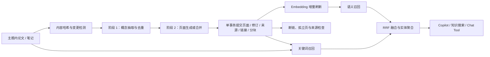

# LLM Wiki 与混合检索

小妍的 LLM Wiki 把研究主题下分散的论文和笔记，编译成有稳定页面标识、双向链接、来源依据与修订记录的知识层。它不是对 RAG 的替代，而是位于原始材料与问答之间的可审阅语义层。

## 1. 使用方法

1. 在知识库创建研究主题，并把论文或笔记归入该主题。
2. 在设置中配置可用的对话模型。Embedding 模型为可选项；未配置时仍可使用关键词检索。
3. 打开「知识库 → 研究 Wiki」，选择研究主题。
4. 首次点击「增量编译」。编译器只处理从未编译或内容哈希已变化的来源。
5. 阅读生成页的正文和「来源依据」，再选择「审核通过」或「标记争议」。人工编辑会产生新修订。
6. 后续增加或修改论文、笔记后再次增量编译。需要重建全部页面时使用「全部重编」。

AI 生成或重新生成的页面始终回到 `draft`，不会静默覆盖为已审核状态。一次最多处理 10 个变更来源、生成 12 个候选页面；若仍有来源待处理，运行状态为 `partial`，再次增量编译即可继续。

## 2. 应用逻辑



### 两阶段编译

阶段 1 只从变更来源抽取候选页面：稳定 `slug`、标题、页面类型、摘要、来源键和建议链接。候选按规范化 `slug` 合并，防止同一概念被多个来源重复建页。

阶段 2 读取候选所引用的来源以及同 `slug` 的旧页面，生成合并后的 Markdown。提示词要求：

- 关键事实使用 `[source:paper:<id>]` 或 `[source:note:<id>]`；
- 页面关系使用 `[[target-slug|显示标题]]`；
- 来源冲突进入「争议与边界」，不能由模型擅自裁决；
- 更新旧页面时，只保留仍有来源支持的内容。

所有页面生成完成后才开启 SQLite 事务。页面、修订、来源映射、链接和检索分块在同一事务中提交；模型中途失败不会留下半套 Wiki。

### 数据模型

| 表 | 职责 |
| --- | --- |
| `wiki_pages` | 当前页面、稳定 slug、审核状态和当前修订号 |
| `wiki_page_revisions` | 每次模型编译或人工编辑的不可变快照 |
| `wiki_page_sources` | 页面到论文/笔记的来源映射、摘要片段和关系 |
| `wiki_page_links` | 页面间链接；目标不存在时保留为可检查的断链 |
| `wiki_page_chunks` | 带标题路径、内容哈希和可选 embedding 的检索分块 |
| `wiki_compile_sources` | 每个来源的上次内容哈希和编译运行 |
| `wiki_compile_runs` | 编译状态、处理来源数、创建/更新页面数和错误 |
| `wiki_issues` | 缺失来源、缺失摘要、断链、孤立页面、非法来源引用 |

这些表已加入本地备份和 WebDAV 同步范围；`wiki_pages` 走 `updated_at` 的 Last-Write-Wins 合并，修订与关联表按追加记录同步。

## 3. 检索升级

统一检索现在覆盖三类资料：

- 论文分块；
- 知识笔记；
- Wiki 页面分块。

语义通道沿用 cosine similarity；关键词通道对标题命中加权，并兼容英文 token 与中文双字词。两个通道各自排序后使用 Reciprocal Rank Fusion：

```text
score(d) = Σ channel_weight / (60 + rank(d))
```

关键词通道权重为 `1.15`，使精确术语命中不会被相近但不准确的向量结果淹没。同一论文或 Wiki 页的多个分块按实体聚合：首个命中保留完整贡献，后续分块以 `0.3` 尾部权重补充。最终结果进入 Copilot 上下文后，现有 Graph RAG 仍会继续扩展主张、证据和引用关系。

直接命中 Wiki 页面时，最多为最终窗口预留 20% 扩展一跳页面关系。`reviewed` 页面保持完整权重，`draft` 和 `contested` 页面会在来源名称中明确标记，并分别按 `0.72`、`0.60` 降权，避免未审核综合内容压过原始证据。

Embedding 未配置或请求失败时，系统不再返回空数组，而是自动退回关键词检索。

## 4. 审核与健康检查

页面状态：

- `draft`：模型新建或重编，等待人工审核；
- `reviewed`：用户确认可作为可信知识页；
- `contested`：存在冲突或尚未解决的边界；
- `archived`：保留历史，但不参与检索。

「检查」会重建当前主题的开放问题，检测无来源页面、已删除的来源记录、无摘要页面、断链、孤立页面，以及正文中未登记的 `[source:...]`。健康问题可以直接定位到页面。

## 5. 命令接口

桌面端 Tauri 命令：

- `wiki_list_pages`
- `wiki_get_page`
- `wiki_compile_interest`
- `wiki_update_page`
- `wiki_lint_interest`
- `wiki_list_issues`
- `wiki_list_compile_runs`

前端统一通过 `apiClient.wiki` 调用。副作用与加载状态集中在 `features/wiki/useWikiWorkspace.ts`，页面组件只做组合和展示。

## 6. 参考实现与取舍

实现前将参考源码克隆到被 Git 忽略的 `tmp/llm-wiki-references/`：

| 仓库 | 本次参考版本 | 许可证 | 采用的设计思想 |
| --- | --- | --- | --- |
| `atomicstrata/llm-wiki-compiler` | `bed4dda` | MIT | 两阶段编译、哈希增量、事务写入、来源与审查 |
| `NiharShrotri/llm-wiki` | `940730b` | MIT | draft/merge 流程、运行记录、混合检索、Wiki 规范 |
| `nashsu/llm_wiki` | `9b71ade` | GPL-3.0 | 仅参考 Rust/Tauri、RRF 和图扩展架构；未复制源码 |

当前版本没有引入独立向量数据库，也没有复制 GPL 代码。继续使用现有 SQLite 与 JSON embedding，以最小迁移成本先完成可信 Wiki 闭环。数据量扩大后，可以把 `wiki_page_chunks` 和 `paper_chunks` 的向量通道迁移到 sqlite-vec、LanceDB 或外部向量索引，而不改变页面、修订和来源模型。

## 7. 开发验证

```bash
cargo test --manifest-path apps/desktop/src-tauri/Cargo.toml services::wiki
pnpm --filter @research-copilot/desktop type-check
pnpm type-check
pnpm lint
```

测试覆盖 slug/引用解析、标题感知分块、候选去重、修订与链接写入、Wiki 健康检查、RRF 聚合，以及无 embedding 时的三类资料关键词召回。
